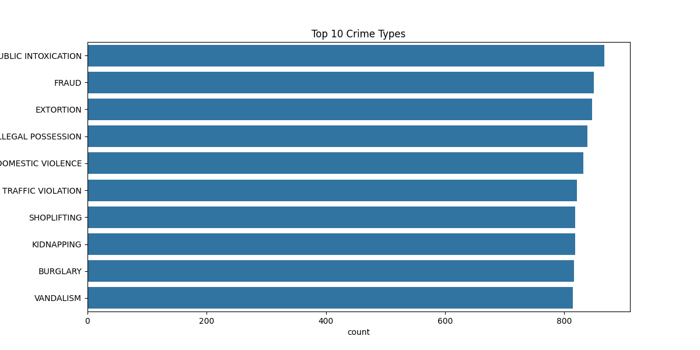

# Crime Analytics Dashboard using Python & Power BI

## Project Overview
This project analyzes crime datasets to identify crime patterns, trends, and insights using Python and Power BI.

The project includes:
- Data Cleaning
- Exploratory Data Analysis
- Crime Visualization
- Dashboard Preparation

---

## Technologies Used
- Python
- Pandas
- NumPy
- Matplotlib
- Seaborn
- Jupyter Notebook
- Power BI

---

## Project Structure

```text
crime-analytics-dashboard/
│── data/
│── notebooks/
│── dashboard/
│── images/
│── results/
│── requirements.txt
│── README.md
```

---

## Features
- Crime trend analysis
- Top crime category visualization
- City-wise crime analysis
- Victim demographic analysis
- Data cleaning and preprocessing

---

## Sample Visualization
Top 10 Crime Types chart created using Seaborn and Matplotlib.

### Top 10 Crime Types


---

## Future Improvements
- Interactive Power BI Dashboard
- Machine Learning Crime Prediction
- Real-Time Crime Monitoring
- Geographic Crime Mapping

---

## Author
Thushanthan R